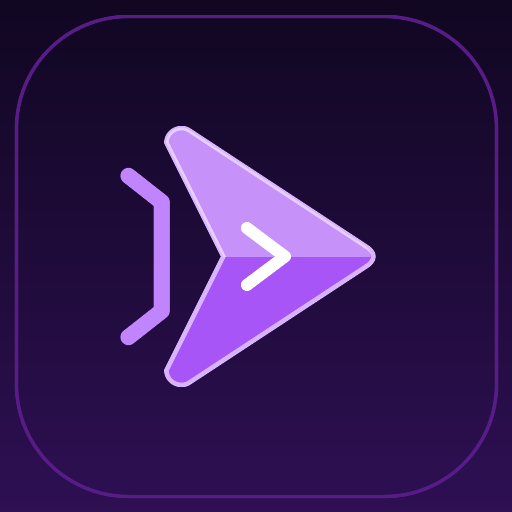
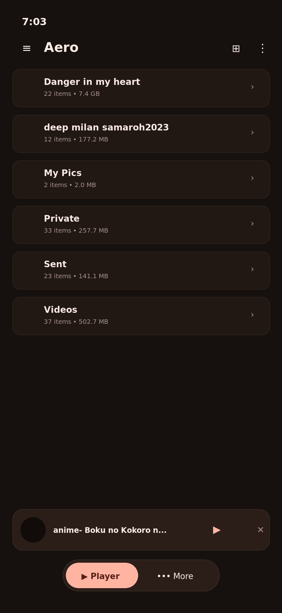
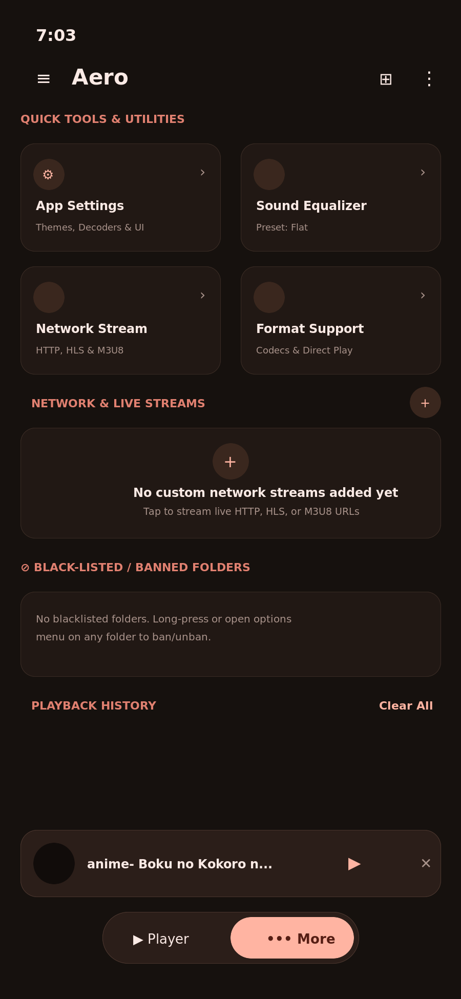
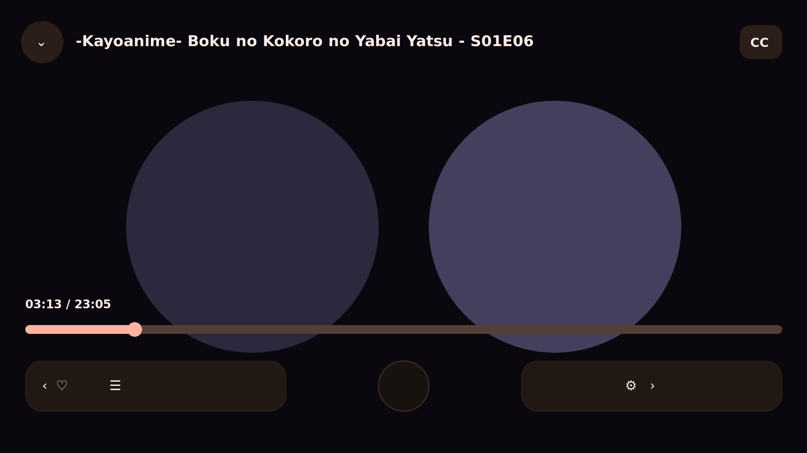

<div align="center">

  

  # Aero Player
  ### Standalone Dual-Engine Android Media Powerhouse

  [](https://github.com)
  [](https://github.com)
  [](https://kotlinlang.org)
  [](https://developer.android.com/jetpack/compose)
  [](LICENSE)

  <br/>

  > ### **Made with 🍁 By Shubh jain**

  <p align="center">
    <b>Aero Player</b> is an ultra-modern, high-performance media player for Android engineered with a <b>standalone dual playback engine architecture</b> (Google Media3 ExoPlayer + Native LibVLC). Featuring fluid glassmorphic UI, custom subtitle rendering, 5-band parametric equalizer, smart folder management, and spring-animated floating pill controls.
  </p>

</div>

---

## 📸 Showcase & Visual Tour

<table align="center" style="border: none; text-align: center; width: 100%;">
  <tr>
    <td width="50%" align="center">
      <b>📁 1. Smart Folder Management & Media Organization</b><br/><br/>
      
    </td>
    <td width="50%" align="center">
      <b>🎛️ 2. Quick Tools, Sound Equalizer & Streams</b><br/><br/>
      
    </td>
  </tr>
  <tr>
    <td colspan="2" align="center">
      <br/>
      <b>🎬 3. Immersive Landscape Player with Smooth Collapsible Control Pills</b><br/><br/>
      
    </td>
  </tr>
  <tr>
    <td colspan="2" align="center">
      <br/>
      <b>🚀 4. Aero Deck Pro Dashboard & Standalone Dual-Engine Switcher</b><br/><br/>
      
    </td>
  </tr>
</table>

---

## ⚡ Standalone Dual-Engine Architecture

Aero Player integrates two completely independent playback engines. Switch between them on-the-fly via the **Aero Deck Pro Dashboard** with zero frame-buffer stutter and millisecond-accurate timestamp persistence:

```
                  ┌────────────────────────────────────────┐
                  │          AERO PLAYER CONTROL           │
                  │   Unified State & Session Coordinator  │
                  └───────────────────┬────────────────────┘
                                      │
              ┌───────────────────────┴───────────────────────┐
              ▼                                               ▼
  ┌─────────────────────────┐                     ┌─────────────────────────┐
  │   Google Media3 Core    │                     │   Native LibVLC 3.6     │
  │     (ExoPlayer 1.4)     │                     │     (ARM64 Native)      │
  ├─────────────────────────┤                     ├─────────────────────────┤
  │ • Zero-overhead HW      │                     │ • Universal codec pack  │
  │ • Jellyfin Dolby AC3    │                     │ • MKV / FLV / WMV / VOB │
  │ • TrueHD & E-AC3 audio  │                     │ • ISO & DVD stream dec. │
  │ • Ultra-low battery use │                     │ • RTSP / RTMP / MMS     │
  │ • HDR10+ / Dolby Vision │                     │ • UDP Multicast streams │
  └─────────────────────────┘                     └─────────────────────────┘
```

### 1. ExoPlayer Core (Google Media3)
- **Direct Surface Hardware Rendering**: Ultra-low battery consumption and zero frame drops on high-bitrate 4K UHD video streams.
- **Dolby Audio Pipeline**: Native decoding for Dolby Digital (`AC3`), Dolby Digital Plus (`E-AC3`), and TrueHD audio tracks.
- **Color Gamut**: Automatic tone-mapping for HDR10, HDR10+, and Dolby Vision content.

### 2. VLC Core (LibVLC 3.6 ARM64 Native)
- **Universal Codec Support**: Play any media container or legacy format without conversion: `.mkv`, `.flv`, `.wmv`, `.vob`, `.ts`, `.avi`, `.3gp`.
- **Live Stream Protocols**: Real-time network stream playback over RTSP, RTMP, HTTP Live Streaming (HLS), MPEG-DASH, MMS, and UDP multicast.
- **Direct Demuxing**: High-precision multi-track audio and subtitle extraction directly from container headers.

---

## 🌟 Key Features

### 🎛️ Dynamic Floating Pill Controls
- **Spring-Physics Motion**: Left and right floating pill containers powered by Compose Spring physics (`Spring.DampingRatioLowBouncy`).
- **Smooth Collapsible Animations**: Fluid horizontal expand/shrink in landscape, vertical expand/shrink in portrait with 180° chevron rotation.
- **Left Control Pill**: Playback speed (0.25x – 4.0x with pitch preservation), A-B loop repetition, aspect ratio scaling (Fit, Crop, 16:9, 4:3, Fill), and Equalizer shortcut.
- **Right Track Pill**: Audio track selector, Subtitle track selector, Screen orientation lock, and Picture-in-Picture trigger.

### 💬 Unified Subtitle Engine
- **Universal Format Support**: SubRip (`.srt`), SubStation Alpha (`.ssa` / `.ass`), and WebVTT (`.vtt`).
- **Live Typography Customization**: Select fonts (Inter, Roboto, Monospace, Sans-Serif), customize text size (12sp – 48sp), adjust primary and outline colors, and tweak background box opacity.
- **Millisecond Precision Sync**: Calibration slider from `-5000 ms` to `+5000 ms` for audio/subtitle sync offsets.
- **Encoding Detection**: Automatic charset negotiation with manual override (UTF-8, UTF-16, ISO-8859-1, Windows-1252, GBK, Big5).

### 🎚️ Parametric Audio Suite
- **5-Band Equalizer**: 60Hz, 230Hz, 910Hz, 3.6kHz, and 14kHz adjustable bands with presets (Flat, Bass Boost, Cinema Surround, Vocal).
- **Bass Boost & Virtualizer**: Low-end enhancement up to +15dB and 3D spatial virtualization.
- **Audio Routing**: Headphone safety normalization and automatic pause/resume on headset disconnect (`AUDIO_BECOMING_NOISY`).

### 👆 Intuitive Gesture HUD
- **Left Edge Swipe**: Screen brightness adjustments (0% – 100%) with haptic feedback.
- **Right Edge Swipe**: Media volume control (0% – 100%) independent of system ringer volume.
- **Horizontal Scrubbing**: Rapid seek with timeline preview and elapsed/remaining timestamps.
- **Double-Tap Seeking**: Fast forward (+10s) and rewind (-10s).
- **Pinch-to-Zoom**: Smooth zoom-in up to 300% on any video frame.

### 📂 Smart Media Library & Folder Organization
- **Smart Folder Mode**: Group and view local videos organized by filesystem directories with item count badges and total storage size.
- **Instant Search & Multi-Criteria Sort**: Filter videos by name, date added, file size, or resolution.
- **Comprehensive History & Bookmarks**: Resume video playback from the exact millisecond where you left off.
- **Home Screen App Widgets**: Interactive 4x1 and 2x2 Android home screen widgets.

### 🤖 CLI Automation Broadcast Receiver
Automate testing, benchmarking, or headless playback control via ADB:
```bash
# Play / Pause toggle
adb shell am broadcast -a com.aerotech.aeroplayer.ACTION_PLAY_PAUSE

# Seek playback by offset
adb shell am broadcast -a com.aerotech.aeroplayer.player.VLC_CLI --es action "seek_by" --el offset_ms 10000

# Switch playback engine dynamically
adb shell am broadcast -a com.aerotech.aeroplayer.player.VLC_CLI --es action "engine" --es engine "VLC"
```

---

## 🏷️ Package Architecture

The codebase is organized under `com.aerotech.aeroplayer`:
```
com.aerotech.aeroplayer
 ├── cast               # Google Cast & Remote Media Routing
 ├── data               # Room Database, DAOs, Entities & Media Repositories
 ├── domain             # Clean Architecture Use Cases & Domain Models
 ├── player             # Dual Engine (ExoPlayer + VLC) & Unified Subtitles
 ├── receiver           # Lockscreen & ADB Broadcast Receivers
 ├── service            # Foreground Media Playback Service & PiP
 ├── ui                 # Jetpack Compose Screens, M3 Theme & Components
 └── util               # Content Resolvers, Format Detectors & Helpers
```

## 🚀 CI/CD Release Workflow

Aero Player includes an automated GitHub Actions workflow (`.github/workflows/release.yml`) that **automatically triggers on every push to `main`**:
1. **Auto Version Extraction**: Directly extracts `versionName` (e.g. `1.4.6`) and `versionCode` from `app/build.gradle.kts`.
2. **Build & Signing**: Compiles the release APK using JDK 17 and Gradle, decoding signing credentials securely from GitHub Secrets.
3. **Artifact Generation**: Generates `AeroPlayer-v1.4.6.apk` along with SHA256 checksums.
4. **GitHub Releases**: Publishes a tagged GitHub Release with downloadable APKs and changelog notes.

### 🔑 GitHub Secrets Configuration
Add the following optional secrets in GitHub (`Settings -> Secrets and variables -> Actions`):

| Secret Name | Description | Example / Format |
|---|---|---|
| `KEYSTORE_BASE64` | Base64-encoded release `.keystore` / `.jks` | `cat release.keystore \| base64 -w 0` |
| `KEYSTORE_PASSWORD` | Password for the release keystore | `your_keystore_password` |
| `KEY_ALIAS` | Key alias name inside the keystore | `aerokey` |
| `KEY_PASSWORD` | Password for the key alias | `your_key_password` |

*(Note: If no secret is configured, the workflow uses the repository's fallback keystore for zero-setup builds).*

---

## 🛠️ Building Locally

```bash
# Compile debug build
gradle assembleDebug

# Compile release build
gradle assembleRelease

# Run unit tests
gradle :app:testDebugUnitTest
```

---

<div align="center">
  <sub>Made with 🍁 By <b>Shubh jain</b> · Aero Player Engine v1.4.6</sub>
</div>
